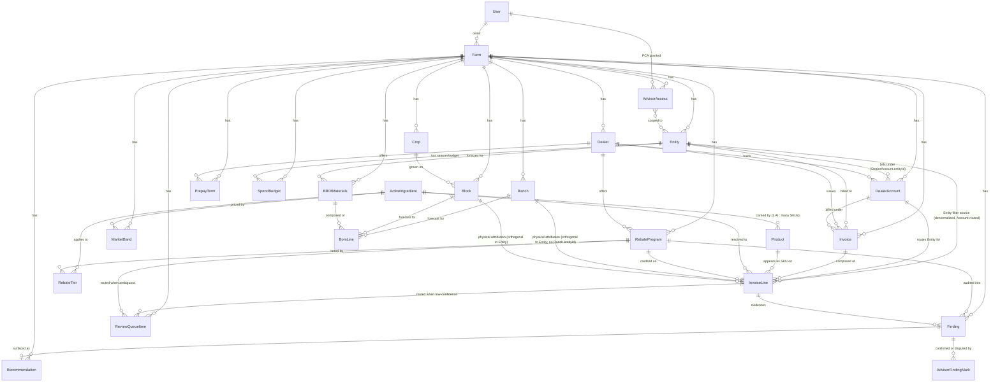
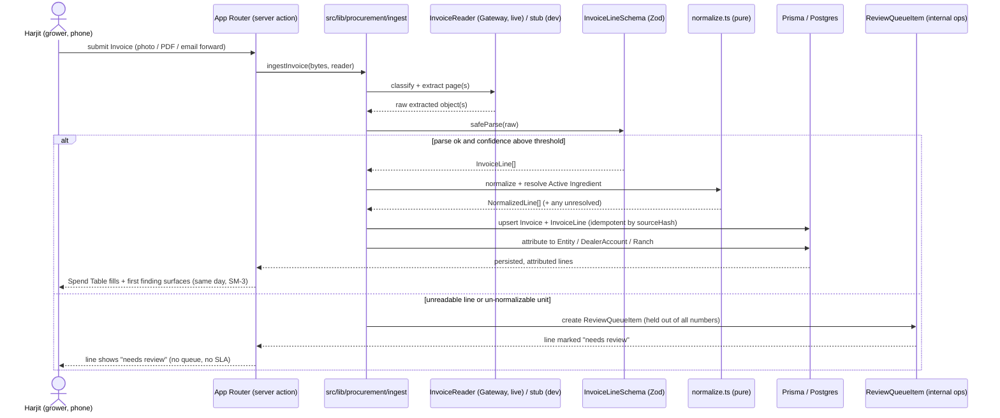
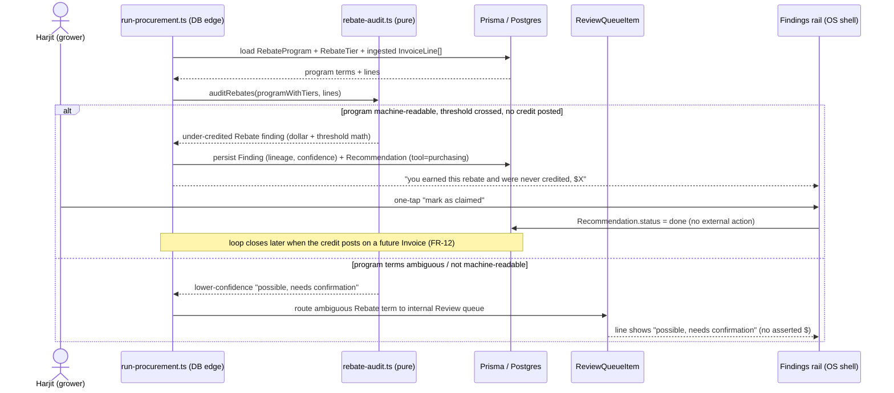

# Architecture: Terra Purchasing Agent (Tool 2)

This is the solution design (architecture) for the Terra Purchasing Agent, Tool 2 in the
existing Terra repo. It is the technical companion to the
[PRD](../2-planning/prd.md) and the [epic breakdown](../2-planning/epics.md), and it
builds on the [product brief](../1-analysis/product-brief.md). It does not restate scope or
requirements; it decides how the seventeen functional requirements and nine
non-functional requirements are built inside the Next.js + TypeScript + Prisma + Postgres
app that already ships Tool 1 (the PG&E energy tool).

The governing rule of this document: the Purchasing Agent is not a new app. It is a second
tool that lands on the same shared data model, the same Recommendation grammar, the same OS
shell, the same vision-extraction discipline, and the same credential discipline as Tool 1.
Every decision below extends a pattern that already exists in the repo rather than inventing
a parallel one. The eventual monorepo split (when Tool 3 starts) stays mechanical because
the boundaries here are the boundaries Tool 1 already keeps: pure math in `src/lib`, a clear
data model in `prisma/schema.prisma`, and a thin UI and server-action layer in `src/app`.

Glossary terms from [PRD section 3](../2-planning/prd.md) are used verbatim (Input, Active
Ingredient, SKU, Generic Equivalent, Dealer, Co-op, PCA, Rebate, Prepay, Dealer order sheet,
Invoice, Bill of Materials, Crop Plan, Market Band, Overpayment, Recommendation, Entity,
Ranch/Block, Account, Spend Budget, Forecast spend, Committed spend, Spend Table, Buy Window
Calendar, Price Band Chart, Findings rail, Review queue). Plain operator English throughout,
no exclamation marks, no em dashes in user-facing copy.

---

## 1. Context and Goals

### 1.1 What this tool is, architecturally

The Purchasing Agent is a retrospective legibility-and-audit engine over a grower's own input
Invoices and Crop Plan. Architecturally it is four pipelines feeding one display surface:

1. **Ingestion.** Invoice photo, PDF, or email forward becomes a Zod-validated canonical
   Invoice with attributed lines (mirrors the Tool 1 `src/lib/extract` bill pipeline).
2. **Pure calculation.** Normalization to per-unit Active Ingredient, the single-grower
   Market Band, Overpayment, the Rebate and Prepay audit, the Bill of Materials forecast.
   This is the provably-correct core, modeled on `src/lib/energy` (no UI, no DB).
3. **Recommendation.** Findings become display-only Recommendations in the existing grammar,
   loop-closed after later Invoices post (mirrors `src/lib/recommendations`).
4. **Views.** The three-views discipline carried from Tool 1: Buy Window Calendar (home),
   Spend Table (Excel bridge), Price Band Chart (behind a tap), with the persistent Findings
   rail from the OS shell.

A human-in-the-loop internal Review queue sits across ingestion and calculation, holding
low-confidence work out of every asserted dollar figure.

### 1.2 Goals

- **Reuse, do not rebuild.** Land on the existing shared schema, grammar, OS shell, vision
  boundary, AI Gateway boundary, and Vitest/Playwright harness. New code is additive.
- **Provable correctness.** Every dollar a grower sees traces line by line to an Invoice
  through pure, unit-tested functions in `src/lib/procurement`. No number is fabricated.
- **Honest by construction.** Thin Market Bands, ambiguous Rebate terms, and unreadable
  lines are structurally incapable of producing an asserted figure (they route to the Review
  queue and carry a `needs review` / `possible, needs confirmation` state).
- **Provable lineage.** Every saved dollar carries enough data lineage that a future
  gain-share claim (SM-1b) can be defended against the Savings Attribution unknown
  ([PRD section 8, #1](../2-planning/prd.md)).
- **Zero external calls in dev and test**, against committed fixture Invoices and a
  Batth-shaped procurement seed (NFR-2).
- **Monorepo-ready.** Procurement math, schema, and UI stay cleanly separated so the move is
  moving files, not untangling them.

### 1.3 Non-goals (architecture restates the PRD line, does not soften it)

No transaction, no purchase, no payment, no Dealer login, no Dealer credential storage, no
RFQ, no auto-PO, no auto-buy, no cross-grower pooling, no gain-share billing in v1. The
Recommendation `action` field is shaped to be executable later, but v1 contains no execution
path. These are enforced architecturally, not just by policy, in section 9.

---

## 2. Project Context Analysis

### 2.1 Requirements overview

**Functional (17 FRs, six feature clusters):** ingestion and attribution (FR-1, FR-2);
forecast and calendar (FR-3, FR-4); normalization, band, generic equivalent (FR-5, FR-6,
FR-7); overpayment, rebate and prepay audit, recommendations, loop closure (FR-8 through
FR-12); cross-entity Spend Table and budget (FR-13, FR-14); advisor visibility (FR-15,
FR-16); and the internal Review queue (FR-17) that backstops the honesty of all of them.

**Non-functional (9 NFRs):** credential discipline (NFR-1), zero external calls in dev/test
(NFR-2), human-in-the-loop by default (NFR-3), honest-number discipline (NFR-4), mobile-first
plain operator English (NFR-5), shared data model and clean boundaries (NFR-6), data
portability and governance (NFR-7), data hero leads and money is not a lone hero (NFR-8), and
confidence-carrying findings (NFR-9).

### 2.2 Scale and complexity

- **Primary domain:** full-stack web application (Next.js App Router), additive to a
  brownfield codebase.
- **Domain complexity:** the data and trust profile is fintech-adjacent (a grower's
  financial Invoices, a future gain-share billing model gated on auditable attribution), so
  the financial-data-governance and honest-number discipline are first-class, not afterthoughts.
- **Data scale:** Batth-shape is the design target: roughly 6 Entities, 4 Dealers, dozens
  of Accounts, 180-plus Invoice lines per season. The Spend Table must stay filterable at
  that line count (FR-13), so server-side aggregation and indexed queries matter; the volume
  itself is modest for Postgres.
- **Compute shape:** ingestion is a bursty, latency-tolerant AI batch job (vision extraction
  over a stack of Invoices); the calculation layer is cheap pure CPU; the views are
  read-mostly server components. None of this needs real-time infrastructure.

### 2.3 Cross-cutting concerns

Multi-entity scoping (every query scoped by `farmId`, and PCA reads further scoped to granted
Entities), extraction confidence and the Review-queue gate, idempotent re-ingest, the
dealer-account identity join, savings-attribution lineage, and credential discipline. Each is
decided once in section 8 and applied everywhere.

---

## 3. Starter and Stack (inherited, not selected)

There is no greenfield starter decision. This product ships inside the existing Terra app and
inherits its stack verbatim. Versions below reflect the repo as of 2026-06-14 (the repo
migrated SQLite to PostgreSQL on this date; do not reintroduce SQLite).

| Layer | Choice | Source in repo |
|---|---|---|
| Framework | Next.js (App Router) + Turbopack | `package.json`, `next.config.ts` |
| Language | TypeScript, strict, no `any` (ESLint flat config enforces) | `tsconfig.json`, ESLint |
| Styling / UI | Tailwind v4, Magic UI via shadcn CLI, `cn` at `@/lib/cn` | `components.json`, `globals.css` |
| ORM | Prisma v6 (`url` + `directUrl`, pooled Neon + unpooled for DDL) | `prisma/schema.prisma` |
| Database | PostgreSQL (Neon in prod, local Postgres for tests) | `prisma/schema.prisma` |
| Auth | Auth.js v5 (`@auth/prisma-adapter`), Google + magic-link | `src/lib/auth.ts` |
| AI extraction / agent | Vercel AI Gateway + AI SDK v6 `generateObject` / tool-calling | `src/lib/ai/gateway.ts`, `src/lib/extract/reader.ts`, `src/lib/almond` |
| Validation | Zod (single source of truth for extracted shapes) | `src/lib/extract/schema.ts` |
| Tests | Vitest (pure + `*.db.test.ts` integration), Playwright e2e | `vitest`, `e2e/*.spec.ts` |
| Deploy | Vercel; runtime fixtures via `outputFileTracingIncludes` | `next.config.ts` |

The one new stack capability the Purchasing Agent introduces is reading a non-PG&E document
(a Dealer Invoice) through the same vision boundary. That is a new prompt and a new Zod
schema, not a new dependency.

---

## 4. Extended Data Model

### 4.1 Design principles

- **Extend the shared schema in place.** New procurement models live in the single
  `prisma/schema.prisma` alongside Farm, Entity, Account, Ranch, Block, Crop, Recommendation.
  Every procurement row is reachable from `Farm` (the scoping root) exactly as energy rows are.
- **Reuse existing entities, never fork them.** `Entity`, `Account`, `Ranch`, `Block`,
  `Crop`, and `Recommendation` are reused as-is. A `Dealer` is a new source type analogous to
  a utility; a procurement `Account` reuses the existing `Account` model where the account
  number is a Dealer account rather than a PG&E account (see the identity-join note, section
  8.3). Where the existing `Account` is too PG&E-specific to overload cleanly, a parallel
  `DealerAccount` is introduced; this document specifies `DealerAccount` to keep the energy
  `Account` semantics untouched, with `Account.entityId` as the precedent pattern.
- **Money is integer cents, never a float.** This is the Tool 1 money law (`amountCents` on
  `BillingLineItem`, `NemPeriod`). Every dollar field below is `Int` cents. Per-unit prices
  that need sub-cent precision (a price per ounce of active ingredient) keep full precision as
  `Float`, exactly as `BillingLineItem.rate` does, and only the line total is cents.
- **Union fields stay `String`, mirrored by a TS union** in
  `src/lib/procurement/types.ts`, the same discipline as `src/lib/recommendations/types.ts`
  (`CoverageState`, `PumpStatus`). Postgres enums are deferred to one schema-wide promotion,
  consistent with the existing schema note.
- **Add a table only when the first story that needs it is built** (epic guidance). The model
  below is the full v1 target; migrations land per-epic.

### 4.2 New Prisma models

The procurement entities, grouped by the pipeline they serve.

**Identity and source**

- **`Dealer`** - a retailer or Co-op of Inputs (Glossary: Dealer; Co-op modeled as a Dealer
  with `kind = "co_op"`). Fields: `id`, `farmId`, `name`, `kind` (`dealer | co_op |
  distributor`), optional `normalizedKey` (for de-dup across Invoice spelling variants, the
  same idea as the Entity billing-name dedup). Relations: many `DealerAccount`, many `Invoice`,
  many `RebateProgram`.
- **`DealerAccount`** - a Dealer or Co-op account number under which purchases bill (Glossary:
  Account). Fields: `id`, `farmId`, `dealerId`, `entityId?` (the legal billing Entity, assigned
  like `Account.entityId`), `number`, `normalizedNumber`. This is the dealer-account analog of
  the PG&E `Account`. The join key (Dealer + account number) is the SA-ID-style identity join
  (section 8.3). Relations: many `Invoice`.

**Ingestion**

- **`Invoice`** - a document from a Dealer recording purchased Inputs (Glossary: Invoice).
  Fields: `id`, `farmId`, `dealerId?`, `dealerAccountId?`, `entityId?`, `invoiceNumber?`,
  `invoiceDate?`, `source` (`photo | pdf | email`), `sourceHash` (the content hash that makes
  re-ingest idempotent, section 8.2), `printedTotalCents?` (reconciliation surface),
  `extractionStatus` (`extracted | needs_review | partial`), `createdAt`. Relations: many
  `InvoiceLine`.
- **`InvoiceLine`** - one line on an Invoice (Glossary: SKU appears on an Invoice line).
  Fields: `id`, `invoiceId`, `skuId?`, `activeIngredientId?`, `rebateProgramId?`,
  `ranchId?`, `blockId?`, `entityId?`, `dealerAccountId?`, `lineType`
  (`product | rebate_credit | prepay | fee | tax | other`), `rawDescription`, `quantity?`,
  `unit?`, `unitPriceCents?`, `amountCents?`, `normalizedUnit?`, `normalizedUnitPrice?`
  (Float, full precision per unit of active), `confidence` (Float 0 to 1),
  `lineState` (`ok | needs_review | needs_confirmation`), `createdAt`. The
  attribution columns (`ranchId`, `blockId`, `entityId`, `dealerAccountId`) are the FR-2
  attribution; nullable until resolved, grower-correctable, never silently dropped.

**Catalog**

- **`Product`** (SKU) - a purchasable product as printed (Glossary: SKU). Fields: `id`,
  `name`, `brand?`, `formulation?`, `packSize?`, `packUnit?`, `activeIngredientId?`,
  `isGeneric` (Boolean), `manufacturer?`. The SKU catalog is shared (not farm-scoped) so the
  same chemistry resolves consistently across growers; it carries no grower-identifying data.
  Relations: many `InvoiceLine`, belongs to one `ActiveIngredient`.
- **`ActiveIngredient`** - the chemically active compound (Glossary: Active Ingredient).
  Fields: `id`, `name`, `casNumber?` (CAS registry number, the stable identity), `standardUnit`
  (the canonical per-unit basis, e.g. `lb_active | gal_active`). One `ActiveIngredient` to many
  `Product` (branded and generic). This is the join that makes two differently-branded SKUs the
  same product for price comparison (FR-5). Shared catalog, no grower data.

**Audit programs**

- **`RebateProgram`** - a manufacturer or Dealer incentive program (Glossary: Rebate /
  Program Pricing). Fields: `id`, `farmId`, `dealerId?`, `name`, `manufacturer?`, `season?`,
  `termsSource` (`grower_entered | extracted_from_document`), `machineReadable` (Boolean; false
  routes findings to the Review queue at lower confidence), `notes?`. Relations: many
  `RebateTier`. Farm-scoped because program terms a grower entered are the grower's data.
- **`RebateTier`** - one threshold, tier, or early-fill milestone within a program. Fields:
  `id`, `rebateProgramId`, `tierType` (`volume_threshold | dollar_threshold |
  early_fill_milestone`), `thresholdQuantity?`, `thresholdUnit?`, `thresholdDate?`,
  `rebateValueCents?` or `rebatePercent?`, `appliesToActiveIngredientId?`. The Rebate audit
  (FR-9) reconciles ingested volume against these tiers.
- **`PrepayTerm`** - a Prepay offer attached to a forecast Input or a Dealer order sheet line
  (Glossary: Prepay). Fields: `id`, `farmId`, `dealerId?`, `activeIngredientId?` or `skuId?`,
  `discountPercent?` or `discountCents?`, `closeDate`, `notes?`. The Prepay timing model (FR-10)
  reads these against the working-capital window.

**Calculation outputs (persisted derivations)**

- **`MarketBand`** - the computed single-grower per-unit price range for an Active Ingredient
  (Glossary: Market Band). Fields: `id`, `farmId`, `activeIngredientId`, `standardUnit`,
  `lowPrice`, `medianPrice`, `highPrice` (Float, full precision), `sampleCount`,
  `reliability` (`reliable | no_reliable_band_yet`), `computedAt`. Farm-scoped and
  single-grower (FR-6); `no_reliable_band_yet` is a first-class state that blocks any
  Overpayment finding (FR-8). Recomputed, not hand-maintained.
- **`Finding`** (Overpayment and the others) - the procurement finding record that maps to a
  Recommendation. Fields: `id`, `farmId`, `recommendationId?` (the surfaced Recommendation, FR-11),
  `findingType` (`overpayment | under_credited_rebate | generic_equivalent | prepay_timing |
  over_budget`), `invoiceLineId?`, `activeIngredientId?`, `rebateProgramId?`, `impactCents?`,
  `confidence`, `state` (`asserted | needs_confirmation | review`), `lineageJson` (the data
  lineage that backs the dollar figure, section 8.5), `createdAt`. A `Finding` is the
  procurement-side, traceable evidence object; the `Recommendation` is its grower-facing
  surface. Keeping them distinct lets the lineage and confidence live on the `Finding` without
  bloating the shared `Recommendation` grammar.

**Spend control**

- **`SpendBudget`** - a grower-set or reviewed season target per Entity (Glossary: Spend
  Budget). Fields: `id`, `farmId`, `entityId`, `season`, `category?`
  (`all | fertilizer | crop_protection | seed`), `budgetCents?` (null is the explicit
  `not set` state, never a fabricated target), `createdAt`, `updatedAt`. Forecast spend and
  Committed spend are computed against this (FR-14); a line becomes Committed spend at its
  obligating event (a `commitmentState` on `BomLine` / `InvoiceLine`, below).
- **`BillOfMaterials`** and **`BomLine`** - the per-product season forecast derived from the
  Crop Plan (Glossary: Bill of Materials). `BillOfMaterials`: `id`, `farmId`, `entityId?`,
  `season`, `computedAt`. `BomLine`: `id`, `bomId`, `blockId?`, `activeIngredientId?` or
  `skuId?`, `forecastQuantity`, `unit`, `buyWindowStart?`, `buyWindowEnd?`, `prepayCloseDate?`,
  `commitmentState` (`forecast | committed`), `commitmentEvent?`
  (`order_sheet_signed | prepay_accepted | invoice_posted`). The forecast is recomputed when the
  Crop Plan changes (FR-3); a Block with no Crop Plan data produces no `BomLine` (no fabrication).

**Advisor and review**

- **`AdvisorAccess`** - a PCA read-only visibility grant (Glossary: PCA, advisor visibility).
  Fields: `id`, `farmId`, `advisorUserId` (the PCA's Auth.js User), `grantedByUserId`,
  `scopedEntityIds` (the Entities shared; a join table `AdvisorAccessEntity` is the relational
  form), `status` (`active | revoked`), `grantedAt`, `revokedAt?`. Read-only and
  Entity-scoped (FR-15); revoke is immediate and leaves no retained copy (the PCA never holds a
  data copy because all reads are live and server-scoped, section 8.4).
- **`AdvisorFindingMark`** - a PCA confirm or dispute on a flagged line (FR-16). Fields: `id`,
  `findingId`, `advisorUserId`, `mark` (`confirmed | disputed`), `note?`, `createdAt`. Feeds
  the retrospective accuracy metric (SM-2). Visible to the grower.
- **`ReviewQueueItem`** - the internal-ops-only human-in-the-loop work surface (Glossary:
  Review queue). Fields: `id`, `farmId`, `itemType` (`unreadable_line | un_normalizable_unit |
  ambiguous_rebate_term`), `invoiceLineId?`, `rebateProgramId?`, `status`
  (`pending | resolved`), `resolvedValueJson?` (the reviewer's confirmed unit/quantity,
  normalized unit, or confirmed Rebate term), `resolvedByUserId?`, `createdAt`, `resolvedAt?`.
  Internal-ops-only: no grower-facing surface, wait time, or SLA (FR-17); the grower only ever
  sees the `lineState` / `Finding.state` on the affected line.

### 4.3 Relationships to existing entities

- `Farm` gains relations to `Dealer`, `DealerAccount`, `Invoice`, `RebateProgram`,
  `PrepayTerm`, `MarketBand`, `Finding`, `SpendBudget`, `BillOfMaterials`, `AdvisorAccess`,
  `ReviewQueueItem`. `Farm` stays the single scoping root for every read.
- `Entity` gains `DealerAccount[]`, `Invoice[]`, `SpendBudget[]`, `BillOfMaterials[]`,
  `AdvisorAccessEntity[]`. Reuses the existing `Entity` model unchanged.
- `Ranch` and `Block` gain `InvoiceLine[]` and `BomLine[]` (the FR-2 attribution and the FR-3
  forecast both attach to the physical operating unit Tool 1 already models). Note that
  `Ranch` has no `entityId` in the real schema: it links only to `Farm` and `Crop`, and the
  energy rollup reaches Entity through `Account` (`Entity -> Account -> Ranch -> Pump`), not
  through a `Ranch.entityId`. Attribution must respect that (see the FR-2 attribution join
  below and section 6.4); a line's Ranch and its Entity are reached by different paths and do
  not have to agree.
- `Crop` is read by the forecast but is NOT the Crop Plan. This is the largest correction in
  this document. The real `Crop` model is only `{ id, name, cropCoefficient, blocks, ranches,
  pumps }`, and a `Ranch` / `Block` carries acreage plus a single nullable `cropId`. There is
  no program, no growth-stage schedule, and no per-crop input program anywhere in the energy
  data model. The forecast formula the PRD and this document both cite (acres times crop times
  **program** times **growth stage**) has no `program` and no `growth stage` to read. So the
  Crop Plan is a net-new modeling requirement, NOT a thing "already modeled by Terra for energy
  in Tool 1" and NOT something `forecast-bom.ts` can "consume, not extend." It does not exist
  in the schema yet. The decision is recorded in section 4.6 and the consequences for FR-3,
  FR-4, and Epic 3 in section 5.2 and the open-questions list (section 14.5, #7).
- `Recommendation` is reused verbatim with `tool = "purchasing"`. The procurement `Finding`
  carries the lineage and confidence; the `Recommendation` carries the grower-facing
  grammar. No change to the `Recommendation` model or the shared `RecommendationAction` type.

### 4.4 Entity relationship diagram



### 4.5 FR-2 attribution join (Entity is Account-routed, Ranch is orthogonal)

FR-2 attributes every line to a Ranch, an Entity, and an Account, but those three are not one
clean join in the real schema, and earlier drafts wrongly drew them as if they composed under
Entity. They do not. The rule, written down so two agents implement it the same way:

- **Entity is authoritative and Account-routed.** A line's Entity is reached through its
  `DealerAccount`, mirroring the energy side where Entity is reached through `Account`
  (`Account.entityId`, nullable until reconciled). `DealerAccount.entityId` is the procurement
  mirror. `InvoiceLine.entityId` is denormalized onto the line and IS the source of truth for
  every Entity filter and the cross-entity Spend Table (FR-13); it is set from
  `DealerAccount.entityId` at attribution time (grower-correctable). The Spend Table aggregates
  `InvoiceLine` grouped by `InvoiceLine.entityId`, indexed `(farmId, entityId)`, never by
  walking Ranch.
- **Ranch / Block is an independent, orthogonal dimension.** `InvoiceLine.ranchId` /
  `blockId` is derived where possible (from the product's typical block use, the Dealer order
  sheet, or a prior line) or grower-confirmed, and it does NOT have to agree with the line's
  Entity. A line can be attributed to a Ranch whose meters bill under a different Entity than
  the line's `DealerAccount.entityId`, and there is no schema-level reconciliation forcing
  them to match (the energy `Ranch` has no `entityId` to reconcile against). This is expected,
  not a bug: a ranch can hold meters from more than one account, and procurement spend routes
  by who was billed (Account), while physical use routes by where it was applied (Ranch).
- **Decision on `Ranch.entityId`.** We do NOT add `Ranch.entityId`. The energy rollup stays
  `Entity -> Account -> Ranch -> Pump`, and procurement stays Account-routed for Entity. Adding
  a `Ranch.entityId` would assert a single-Entity-per-Ranch fact the energy model deliberately
  does not make (the comment on `Ranch` in `schema.prisma` is explicit that a ranch is not
  nested strictly under an account). Ranch/Block attribution stays the orthogonal,
  derivable-or-confirmed dimension; Entity stays Account-routed and authoritative.

The columns and indexes this needs: `InvoiceLine.entityId` (source of truth for the Entity
filter), `InvoiceLine.ranchId` / `blockId` (orthogonal physical attribution),
`DealerAccount.entityId` (the mirror of `Account.entityId`), and an
`@@index([farmId, entityId])` on `InvoiceLine` for the Spend Table aggregation.

### 4.6 The Crop Plan is a net-new model (Epic-1/3 blocker), not a reused energy entity

The single largest gap in this design, and the one earlier drafts mislabeled as minor: the
"Crop Plan" the BoM forecast cluster (FR-3, FR-4) depends on does not exist in the schema. The
real `Crop` is `{ id, name, cropCoefficient, blocks, ranches, pumps }`; a `Ranch` / `Block`
carries acreage plus a nullable `cropId`. There is no `program`, no growth-stage schedule, and
no per-crop input program. The forecast formula (acres times crop times program times growth
stage) has no `program` or `growth stage` to read, so `forecast-bom.ts` has nothing real to
consume and Epic 3 cannot be built as the PRD specifies until this is resolved. This is a hard
Epic-1 (schema) and Epic-3 (forecast) blocker, not a calibration question.

Two viable paths. The implementer picks one before Epic 3; the architecture supports either:

- **(a) Model the Crop Plan as net-new schema with a grower-supplied ingestion path.** Add a
  per-crop input program the forecast can read: a `CropProgram` (a season program for a Crop or
  a Block, `{ id, farmId, cropId?, blockId?, season }`) with ordered `GrowthStage` /
  `ProgramApplication` children carrying the growth-stage label, the target window, the
  `activeIngredientId` or `skuId`, and the per-acre application rate. `forecast-bom.ts` then
  reads `acres (from Block/Ranch) x program (CropProgram applications) x growth stage` exactly
  as the formula states. Crucially, this data is NOT in the energy export and the grower must
  supply it: a new ingestion path (the Dealer order sheet, a grower-entered program, or a
  vision read of a written spray/fertility plan, routed through the same confidence gate and
  Review queue as Invoices). This is real new modeling and a real new onboarding step, scoped
  into Epic 1 (schema) and Epic 3 (ingestion + forecast).
- **(b) Scope FR-3/FR-4 down to a repeat-buy projection from prior-season Invoices.** Until a
  real Crop Plan model exists, seed the forecast only from already-ingested Invoices: project
  next season's per-product need from what this grower actually bought last season (by Active
  Ingredient, quantity, and timing), attached to the Block/Ranch the prior lines were
  attributed to. This needs no new program schema (it reuses `InvoiceLine`), keeps the Buy
  Window Calendar honest (a projection from real prior purchases, clearly labeled as such, not
  a fabricated agronomic plan), and unblocks Epic 3 on the data that already exists. It is
  weaker for a new crop or a changed program, and it is explicitly a repeat-buy heuristic, not
  the agronomic Crop Plan the PRD describes.

Recommendation: ship (b) first (it unblocks the calendar on real data with no new ingestion),
and treat (a) as the path to the full agronomic forecast once a grower-supplied Crop Plan
ingestion is built. Either way, `forecast-bom.ts`'s signature and the "no data, no line" rule
hold; what changes is the source it reads (a `CropProgram` in (a), prior `InvoiceLine`s in (b)),
never an invented estimate.

---

## 5. Pure Calculation Layer (`src/lib/procurement`)

### 5.1 Contract

This is the provably-correct core, modeled exactly on `src/lib/energy`: pure functions, no UI,
no DB, no clock (callers pass `asOf` and `createdAt`), each colocated with a `*.test.ts`. They
take plain data in (canonical Invoice lines, catalog rows, program terms, the Crop Plan) and
return plain data out (normalized lines, bands, findings, draft recommendations). The DB edge
in `src/app` and the importer load rows, call these functions, and persist the results; the
functions themselves never touch Prisma. This is the same split as the Green Button parser
feeding the importer, and `src/lib/energy/recommend.ts` feeding the DB run.

The unit-of-money law from Tool 1 carries: amounts are integer cents at boundaries; per-unit
prices keep full Float precision and round to cents only at the displayed total.

### 5.2 Modules

- **`normalize.ts`** - resolve a line's SKU to its Active Ingredient and convert its unit to
  the ingredient's `standardUnit`, yielding a per-unit price. Pure unit math (gallons, pounds,
  ounces of active). A line whose Active Ingredient cannot be resolved, or whose unit cannot be
  converted, returns a `needs_review` / `un_normalizable` outcome (never a force-match), which
  the caller routes to the Review queue (FR-5, FR-17). Contract:
  `normalizeLine(line, sku, activeIngredient): NormalizedLine | UnresolvedLine`.
- **`band.ts`** - compute the single-grower Market Band (low, median, high) for an Active
  Ingredient from this grower's own normalized lines only, and decide reliability. Below a
  configured minimum comparable-point count it returns `no_reliable_band_yet` (FR-6, SM-C1).
  No external price source is ever an input; the function signature only accepts the grower's
  own normalized lines, which makes cross-grower contamination a type error, not a policy.
  Contract: `computeBand(normalizedLines, config): MarketBand`.
- **`overpayment.ts`** - given a normalized line and a reliable band, compute the per-unit gap
  and the dollar impact, or return no finding when the band is `no_reliable_band_yet` (FR-8).
  Contract: `flagOverpayment(line, band): OverpaymentFinding | null`.
- **`rebate-audit.ts`** - reconcile ingested volume against a `RebateProgram`'s tiers,
  thresholds, and early-fill milestones; flag an under-credited Rebate with the dollar amount
  and threshold math when volume crossed a threshold and no credit line posted. A
  non-machine-readable program yields a lower-confidence `needs_confirmation` finding rather
  than an asserted figure (FR-9, FR-17, NFR-9). Contract:
  `auditRebates(programWithTiers, invoiceLines): RebateFinding[]`.
- **`prepay.ts`** - model Prepay timing for a forecast Input: present the discount, the close
  date, and a plain-language trade-off note weighing early-order discount against the
  working-capital cost and counterparty risk. Never instructs a purchase (FR-10, NFR-3).
  Contract: `assessPrepay(prepayTerm, forecastLine, workingCapitalContext): PrepayAssessment`.
- **`forecast-bom.ts`** - translate a forecast source into a per-product Bill of Materials with
  quantities, buying windows, and Prepay closes; produce no line for a Block with no forecast
  data (FR-3, FR-4, NFR-4). The source is NOT the energy `Crop` (which has no program or
  growth stage); it is either a net-new `CropProgram` (path (a), section 4.6) read as `acres x
  program applications x growth stage`, or a repeat-buy projection from prior-season
  `InvoiceLine`s (path (b)). The function stays pure either way and never invents an estimate.
  Contract (path (a)): `forecastBom(cropProgram, blocks, asOf): BomLine[]`; contract (path
  (b)): `projectRepeatBuy(priorSeasonLines, asOf): BomLine[]`. Whichever path Epic 3 ships, the
  "no data, no line" rule is the honest gate. This module is blocked on the section 4.6
  decision before Epic 3 can be built.
- **`types.ts`** - the procurement union types mirrored from the schema String columns
  (`LineType`, `LineState`, `FindingType`, `FindingState`, `BandReliability`,
  `CommitmentState`, `ReviewItemType`, `RebateTierType`), the same role
  `src/lib/recommendations/types.ts` plays for the grammar. No `any`.

A small `finding-to-rec.ts` (or an addition to `src/lib/recommendations/build.ts`) maps a
procurement `Finding` to a `DraftRecommendation` with `tool = "purchasing"`, reusing
`draftRecommendation`. The `action.label` is plain operator English; `action.execute` is left
`null` in v1 (the agentic hook), and `action.kind` carries the machine verb a later version
would execute (`claim_rebate`, `swap_generic`, `prepay`, `flag_line`).

### 5.3 Why pure

The PRD's load-bearing risks are gaming the band (SM-C1) and asserting a dollar that cannot be
defended (NFR-4). A pure, unit-tested band-and-audit core is how those are guaranteed: the
reliability gate, the unit conversions, and the threshold math are tested in isolation against
fixtures, with no way for a UI shortcut or a DB default to slip a fabricated number past them.

---

## 6. Invoice Ingestion Pipeline

### 6.1 Shape (mirrors `src/lib/extract`)

The ingestion pipeline mirrors the Tool 1 scanned-bill pipeline beat for beat, because that
pipeline already solves this exact problem (a messy photographed financial document becomes
Zod-validated structured data, with unreadable pages routed to `needs_review` and zero
external calls in dev/CI). The new module is `src/lib/procurement/ingest` (or a sibling
`src/lib/invoice-extract`), structured like `src/lib/extract`:

```
photo / PDF / email forward
  -> split            (per-page, reuses src/lib/extract/split.ts for PDFs)
  -> read             (InvoiceReader boundary: classify + extract, injected)
       - dev/CI: stubInvoiceReader fed a committed fixture  -> ZERO external calls (NFR-2)
       - live:   createGatewayInvoiceReader over the AI Gateway (generateObject)
  -> validate         (Zod InvoiceLineSchema; failure -> needs_review, never fabricated)
  -> normalize/attribute (pure: resolve AI, convert unit; resolve Ranch/Entity/DealerAccount)
  -> persist          (idempotent upsert keyed by sourceHash + invoice identity)
```

The vision read reuses the `src/lib/onboarding/vision.ts` discipline (a stubbed boundary
returning a committed sample in v1, with the real signature in place) and the
`src/lib/extract/reader.ts` AI-SDK pattern (a `PageReader`-style boundary, `generateObject`
with a Claude file part, Opus default with a cheaper-first escalation lever). Fixtures are read
from `process.cwd()` (never `import.meta.url`) and shipped on Vercel via
`outputFileTracingIncludes`, exactly as the existing vision and source readers do.

### 6.2 Canonical shape (Zod is the source of truth)

A new `InvoiceLineSchema` / `InvoiceSchema` in the ingest module is the single source of truth
for what the model returns, the same role `src/lib/extract/schema.ts` plays for bill pages.
Every TS type is `z.infer` of its schema. Dollar amounts are integer cents; quantities and
per-unit prices keep full precision; the SKU description is preserved verbatim. Nothing from
this raw layer is imported into `src/app` (the no-raw-source-in-ui guard pattern applies).

### 6.3 Honest-coverage guardrail and the Review queue

A line the model cannot read above the confidence threshold, or whose Zod validation fails,
becomes `lineState = needs_review` and creates a `ReviewQueueItem`. It is excluded from any
Market Band comparison and any asserted figure until resolved (FR-1, FR-17, NFR-4). This is the
exact `needs_review` discipline from `src/lib/extract/pipeline.ts`, extended to financial
lines. The confidence threshold is a single configured constant (section 8.1) so the
structured-vs-review boundary is tuned in one place ([PRD section 8, #6](../2-planning/prd.md)).

A resolved `ReviewQueueItem` writes its `resolvedValueJson` back to the line, which then
re-enters `normalize.ts` (or the Rebate audit), clearing the grower-facing state. The queue is
internal-ops-only: no grower-facing surface, wait time, or SLA.

### 6.4 Attribution (FR-2)

After extraction, each line is attributed along two independent dimensions (the full rule is in
section 4.5). Entity is Account-routed and authoritative: the dealer-account identity join
(section 8.3) resolves the `DealerAccount`, Entity follows from `DealerAccount.entityId`, and
that value is denormalized onto `InvoiceLine.entityId` as the source of truth for the Entity
filter and the Spend Table (FR-13). Ranch and Block are an orthogonal physical dimension,
derived where possible or grower-confirmed, and do NOT have to agree with the line's Entity
(the energy `Ranch` has no `entityId`; a ranch can hold meters from more than one account, so
where a line was applied and who was billed for it are reached by different paths and can
legitimately disagree). A line that cannot be resolved on either dimension is flagged for
grower confirmation, never silently dropped (FR-2). Grower corrections persist and override the
agent's attribution.

### 6.5 UJ-1 ingest flow (component / sequence diagram)



---

## 7. Agent and Recommendation Layer

### 7.1 Findings become display-only Recommendations

The four pure finding producers (`overpayment.ts`, `rebate-audit.ts`, the generic-equivalent
check inside `normalize.ts`, `prepay.ts`) emit procurement `Finding` evidence objects. A run
orchestrator in `src/lib/recommendations` (a `run-procurement.ts` sibling of the existing
`run-rate-lever.ts` / `run-solar-insight.ts`) loads the rows, calls the pure functions, persists
each `Finding` with its lineage and confidence, and maps each to a `DraftRecommendation` with
`tool = "purchasing"` via `draftRecommendation`. The Recommendation appears in the Findings rail
(FR-11). The one-tap response sets `status` to `done | dismissed | overridden` only; no purchase
or external action fires (FR-11, NFR-3). `action.execute` stays `null`.

### 7.2 Loop closure (FR-12)

When a later relevant Invoice posts, the run reconciles the acted-on Recommendation and fills
`result` (predicted vs actual). This **follows the `src/lib/recommendations/result.ts` pattern,
it does not reuse the function itself.** `result.ts` is hard-specialized to PG&E: its
`firstPostedBillAfter` matches the first reconciled `BillingPeriod` carrying `printedTotalCents`
strictly after acceptance over a meter's periods, which is the wrong shape for procurement.
Procurement closure is a different match: a later `InvoiceLine` that credits a rebate (or shows
the swapped generic, or records the prepaid purchase), matched by the Finding's lineage keys
(Active Ingredient, program, tier/threshold), not by a meter's next monthly bill. So this
document specifies a new pure closure function, `firstCreditingInvoiceLineAfter(lineageKeys,
candidateLines, resolvedAtIso): InvoiceLine | null`, that selects the first crediting line
strictly after acceptance matching the Finding's lineage. What IS reused verbatim from
`result.ts` is the genuinely shared pattern, not the engine: the frozen-prediction snapshot
(`acceptanceResult`-style, the prediction persisted on `Recommendation.result` at acceptance so
a re-run cannot rewrite it) plus the realized number DERIVED at read time, and the honesty law
(the realized figure is shown as a fact, the next relevant Invoice's actual credit, never as
attributed savings). A Recommendation marked done without a crediting Invoice line stays open
and counts only toward identified savings (SM-1), never attributed realized savings (SM-1b).
Loop closure is what produces the line-level traceability SM-1b depends on, so at closure the
run appends the crediting-Invoice line ids to the `Finding.lineageJson` (section 8.5), without
overwriting the original lineage.

### 7.3 Where an LLM fits (and where it does not)

The calculation and audit engine is deterministic pure code, not an LLM. The LLM is used in
exactly two bounded places, both already-proven Terra patterns:

1. **Extraction** (vision read of an Invoice), through the `generateObject` + Zod boundary in
   the ingest reader. The model proposes structure; Zod and the confidence gate decide what is
   trustworthy enough to enter the numbers. The model never computes a band, an overpayment, or
   a rebate figure.
2. **An optional read-only assistant**, modeled on Almond (Epic 6). The same farm-scoped,
   read-only, tool-calling pattern (`buildAlmondTools`, deps carry `prisma` + a resolved
   `farmId`, the model can never read another farm) extends cleanly to procurement: new tools
   `getSpend`, `listInvoices`, `getMarketBand`, `listProcurementFindings`, each a thin
   read-only loader shaped by pure helpers. Like Almond, it mutates nothing and surfaces no
   asserted figure the pure engine did not already compute. This is optional for v1 and listed
   as an extension point, not a v1 requirement; if shipped, it stays strictly read-only,
   mirroring the v1 display-never-execute law.

No autonomous action, negotiation, or purchase is anywhere in the agent layer. The
`action.execute` hook exists on the grammar for a later agentic OS but is unused in v1.

### 7.4 UJ-2 rebate-audit flow (component / sequence diagram)



---

## 8. Key Cross-Cutting Decisions

### 8.1 Extraction confidence

One configured threshold constant separates `ok` from `needs_review` for an extracted line,
the same single-knob discipline as the Tool 1 reader. The model returns a per-line
`confidence`; a line below threshold, or one that fails Zod, is held out of all numbers and
routed to the Review queue. The threshold is tuned against fixture Invoices and is an open
calibration question ([PRD section 8, #6](../2-planning/prd.md)). Decision: gate in one place,
in the pure pipeline, never in the UI.

### 8.2 Idempotent re-ingest

A grower will photograph the same Invoice twice. Each `Invoice` carries a `sourceHash` (a
content hash of the uploaded bytes) plus the extracted `(dealerId, invoiceNumber,
invoiceDate)` identity. Re-ingesting the same content upserts rather than duplicates, the same
discipline as the `@@unique([pumpId, start])` upsert keys that make Green Button re-import
idempotent. Decision: upsert on `(farmId, sourceHash)` first, then reconcile against the
extracted invoice identity; never create a second Invoice row for the same document.

### 8.3 Identity / SA-ID-style join on dealer-account

The PG&E side joins extracted bills to inventory on a canonical SA ID (`normalizeSaId` splits
the bare id from a trailing descriptor). Procurement needs the same stable join, on
`(Dealer, account number)`. Decision: a `normalizeDealerAccount` pure utility (sibling of
`normalizeSaId`) produces a `normalizedNumber` and a `normalizedKey` for the Dealer name, so
Invoice spelling variants of the same Dealer and account resolve to one `DealerAccount`. This
is the procurement analog of the energy identity check and the Entity billing-name dedup.

### 8.4 Multi-entity scoping and advisor access

Every read is scoped by `farmId` (the existing pattern; Almond deps carry a single resolved
`farmId` and can never read another farm). A PCA read is scoped twice: by the granting Farm and
by the `AdvisorAccess.scopedEntityIds`. Decision: PCA reads go through a scoped loader that
filters to granted Entities at the query, so a revoked or out-of-scope Entity is never
returned; the PCA holds no data copy because all reads are live and server-side, which makes
revoke immediate and copy-free by construction (FR-15). The PCA can call only read tools and
the confirm/dispute write (FR-16); no edit, budget, or act path exists for an advisor.

### 8.5 Savings-attribution data lineage (provable gain-share later)

The load-bearing monetization unknown is proving a saved dollar is the agent's doing, not the
grower's haggling ([PRD section 8, #1](../2-planning/prd.md)). v1 does not bill, but it must
capture the lineage that makes a future claim defensible. Decision: every `Finding` carries a
`lineageJson` that records, immutably, the exact inputs that produced its figure: the source
Invoice line ids, the Active Ingredient, the band inputs and `sampleCount` and `computedAt`
(or the Rebate program, tier, and threshold-crossing line set), the confidence, and the
`asOf`. At loop closure (FR-12) the crediting-Invoice line ids are appended. This is the
invoice-level, line-traceable track record SM-1b is built from, and the reason under-credited
Rebate recovery (a clean "the agent found a missed credit") is the first cleanly attributable
case. Overpayment-vs-band lineage is captured the same way but is not counted as attributed
until the attribution method is solved. The lineage is append-only evidence, never recomputed
in place, so a past claim stays reconstructable even after a band recomputes.

**The Finding persistence rule (reconciling re-run idempotency with immutable lineage).** This
is a real tension that earlier drafts left unresolved. The established run pattern this design
otherwise mirrors, `run-rate-lever.ts`, is delete-pending-and-recreate: each run does
`prisma.recommendation.deleteMany({ status: "pending" })` then `createMany`. If procurement
`Finding` rows followed that pattern literally, a recompute would DELETE and recreate the very
rows whose `lineageJson` must survive a recompute, destroying exactly what ADR-005 promises.
So `Finding` does NOT follow delete-recreate. The rule, stated so an implementer cannot get it
wrong:

- A `Finding` (and its `lineageJson`) is **never deleted on re-run.** Findings are
  immutable-on-create and re-keyed by a natural key (the lineage identity: `farmId`,
  `findingType`, the source `invoiceLineId` / program + tier, and the band `computedAt` or
  `asOf`). A re-run **upserts by that natural key and never overwrites an existing
  `lineageJson`**; if the inputs changed enough to be a different claim, that is a NEW Finding
  row (a new natural key), and the prior Finding stays on the ledger untouched.
- Only the **surfaced pending `Recommendation`** may be delete-recreated, exactly as
  `run-rate-lever.ts` does, because a pending Recommendation carries no historical claim, only
  the current grower-facing surface. A non-pending (acted-on) Recommendation and every Finding
  are left alone.
- Equivalently and acceptably: if a future engine must recompute a Finding in place, it first
  snapshots the prior `lineageJson` to an append-only ledger before the recompute. The
  upsert-by-natural-key rule above is the simpler default and the one this document chooses.

This is asserted by a DB integration test (section 13): a recompute over the same inputs
preserves every prior `Finding` row and its `lineageJson` byte-for-byte, and only the pending
Recommendation surface is rebuilt.

### 8.6 Honest-number discipline as a type, not a policy

`MarketBand.reliability`, `InvoiceLine.lineState`, and `Finding.state` are first-class union
states. A `no_reliable_band_yet` band and a `needs_review` line are structurally incapable of
producing an asserted Overpayment, because `overpayment.ts` returns `null` for them and the run
never persists a Recommendation without an asserted `Finding`. The word "verified" is reserved
for the loop-closed attributable subset and is a derived view state, never stored on an
unclosed finding (NFR-4, SM-C1).

---

## 9. API and Route Design

### 9.1 Server actions vs route handlers

The Tool 1 precedent is server actions for grower-initiated mutations (the onboarding
`actions.ts` reads the form, calls the testable lib function with the `prisma` singleton, and
redirects or revalidates). The Purchasing Agent follows it:

- **Server actions** (`"use server"`) for: submit/ingest an Invoice, correct an attribution,
  set or review a Spend Budget, respond to a Recommendation (one-tap status), grant or revoke
  AdvisorAccess, and PCA confirm/dispute. Each is a thin wrapper over a testable
  `src/lib/procurement` or `src/lib/recommendations` DB function, keeping logic out of the
  framework edge so integration tests exercise it without Next.
- **Route handlers** (`app/.../route.ts`) only where a non-form HTTP surface is genuinely
  needed: the email-forward ingestion inbound (a webhook from the email provider that drops an
  Invoice into the pipeline) and the CSV export download (FR-13). The email webhook validates
  and enqueues; it never trusts the sender to set `farmId` (it resolves the farm from the
  authenticated forwarding address).
- **The optional read-only assistant** reuses the Almond chat route pattern (a streaming
  tool-calling endpoint), scoped by session `farmId`, if shipped.

### 9.2 Routes and views

New screens live under `src/app/dashboard/purchasing/` (a sibling of `pump-timing/`), reusing
the OS shell, the persistent Findings rail, and the three-views discipline:

- `purchasing/` - Buy Window Calendar (home, FR-4).
- `purchasing/spend/` - Spend Table (FR-13) with filter and CSV export.
- `purchasing/band/[activeIngredientId]/` - Price Band Chart (FR-6, behind a tap).
- `purchasing/budget/` - spend-versus-budget summary (FR-14).
- `purchasing/onboarding/` - connect-a-source ingestion (FR-1, FR-2), value-honest, reusing
  the Tool 1 onboarding shell.
- `purchasing/rec/[recId]/` - a finding's openable math and one-tap response (FR-8, FR-11).
- `purchasing/advisor/` - grant/revoke advisor visibility (FR-15); the PCA's scoped read view
  reuses the same view components behind the scoped loader.

An internal-ops Review-queue surface lives outside the grower app (an admin route), so the
grower never sees a queue (FR-17).

### 9.3 No external write surface

There is no route, action, or tool in v1 that places an order, sends an RFQ, contacts a
Dealer, or moves money. This is enforced by the absence of any such handler and by
`action.execute` staying `null`, not merely by convention.

---

## 10. Implementation Patterns and Consistency Rules

These prevent two agents implementing the same area differently. They extend the conventions
already in the repo.

- **Naming.** Prisma models PascalCase singular (`InvoiceLine`); columns camelCase
  (`unitPriceCents`); union columns are `String` with a mirrored TS union in
  `src/lib/procurement/types.ts`. Files kebab/lowercase matching the energy lib
  (`rebate-audit.ts`, `forecast-bom.ts`); tests colocated as `*.test.ts`; DB-touching tests as
  `*.db.test.ts`. React components PascalCase under `_components/`.
- **Money.** Always integer cents at storage and boundaries (`...Cents`); full-precision Float
  only for per-unit/active prices and rates; round to cents only at the displayed total.
  Mirrors the Tool 1 money law.
- **Purity.** Anything in `src/lib/procurement/{normalize,band,overpayment,rebate-audit,prepay,forecast-bom}.ts`
  is pure: no Prisma import, no `Date.now()`, no env read. The caller passes `asOf` /
  `createdAt`. DB edges live in `src/lib/recommendations/run-procurement.ts` and the ingest
  importer.
- **Raw-vs-canonical separation.** The Zod raw-extraction layer is never imported into
  `src/app`; the canonical, normalized shape is what the UI reads. The existing
  no-raw-source-in-ui test guard pattern is extended to the invoice raw layer.
- **Scoping.** Every loader takes `farmId` explicitly (never a global); PCA loaders take
  `farmId` plus the granted Entity ids. No query trusts a client-supplied `farmId`.
- **Findings and grammar.** Every procurement finding is built through `draftRecommendation`
  with `tool = "purchasing"`; `action.label` is plain operator English (no jargon, no em
  dashes), `action.execute` is `null`. Confidence and lineage live on `Finding`, not on the
  shared `Recommendation` type. A `Finding` is never deleted on re-run: `run-procurement.ts`
  upserts Findings by their lineage natural key and never overwrites `lineageJson` (section
  8.5). The delete-pending-and-recreate idempotency pattern from `run-rate-lever.ts` applies
  ONLY to the surfaced pending `Recommendation`, never to a `Finding` or an acted-on
  Recommendation.
- **Copy.** All grower-facing strings live in `src/copy` (localization-ready), no exclamation
  marks, no em dashes, plain operator English.
- **Fixtures.** Runtime fixture reads use `process.cwd()`, shipped via
  `outputFileTracingIncludes`; committed fixture Invoices and a Batth-shaped procurement seed
  keep dev/test at zero external calls.

---

## 11. Project Structure and Boundaries

New and reused locations. New paths are marked NEW; everything else is reused from Tool 1.

```
Terra/
  prisma/
    schema.prisma                         (EXTEND: + procurement models, section 4)
    migrations/                           (per-epic procurement migrations)
    seed.ts                               (EXTEND: + Batth-shaped procurement seed)
  fixtures/
    procurement/                          NEW: sample Invoices (photo/PDF/email), program docs
    batth-procurement.json                NEW: Batth-shaped seed (entities, dealers, invoices)
  src/
    lib/
      procurement/                        NEW: pure calc + types + ingest
        normalize.ts        normalize.test.ts
        band.ts             band.test.ts
        overpayment.ts      overpayment.test.ts
        rebate-audit.ts     rebate-audit.test.ts
        prepay.ts           prepay.test.ts
        forecast-bom.ts     forecast-bom.test.ts
        dealer-account.ts   dealer-account.test.ts   (identity join, section 8.3)
        types.ts
        ingest/                           NEW: invoice extraction (mirrors src/lib/extract)
          schema.ts         schema.test.ts           (Zod InvoiceLineSchema, source of truth)
          reader.ts                                  (InvoiceReader boundary: stub + Gateway)
          pipeline.ts       pipeline.test.ts         (split -> read -> validate -> needs_review)
          import.ts         import.db.test.ts        (DB importer: persist + attribute, idempotent)
      recommendations/
        run-procurement.ts  run-procurement.db.test.ts  NEW: findings -> Recommendations + loop close
                                          (NEW firstCreditingInvoiceLineAfter; follows result.ts pattern)
        build.ts, types.ts                (REUSE verbatim)
        result.ts                         (REUSE the snapshot PATTERN; PG&E-specialized, not the procurement engine)
      ai/gateway.ts                       (REUSE: shared AI Gateway boundary)
      onboarding/vision.ts                (REUSE pattern for invoice photo read)
      db.ts                               (REUSE: prisma singleton)
    copy/en.ts                            (EXTEND: + purchasing strings)
    app/dashboard/
      purchasing/                         NEW: the tool's screens (section 9.2)
        page.tsx                          (Buy Window Calendar, home)
        spend/, band/, budget/, advisor/, rec/[recId]/, onboarding/
        _components/                      (views; reuse OS shell, Findings rail)
        actions.ts                        NEW: server actions (thin, over the lib)
        api/email-inbound/route.ts        NEW: email-forward ingestion webhook
        api/spend/export/route.ts         NEW: CSV export
      admin/review-queue/                 NEW: internal-ops-only Review queue (not grower-facing)
  e2e/
    purchasing.spec.ts                    NEW: Playwright e2e (mirrors Tool 1 e2e)
```

**Boundaries.** UI (`src/app`) -> server actions / route handlers -> DB-edge functions
(`run-procurement.ts`, `ingest/import.ts`) -> pure calc (`src/lib/procurement/*`). The pure
calc never calls up. The Zod raw layer never reaches `src/app`. The AI Gateway is touched only
by the ingest reader (and the optional assistant), never by the calc or the views.

---

## 12. Non-Functional Requirements (how each is met)

- **NFR-1 credential discipline.** No Dealer/financial/utility credential is requested or
  stored. Ingestion is photo/PDF/email only; there is no Dealer-login field anywhere in the
  schema, actions, or UI. Email-forward inbound resolves the farm by the authenticated
  forwarding address, not by a stored Dealer credential.
- **NFR-2 zero external calls in dev/test.** The InvoiceReader boundary defaults to a stub fed
  committed fixtures; the live Gateway reader is constructed only when a key is present
  (`hasGatewayKey()`), mirroring the existing reader and vision boundaries. Seed and fixtures
  are committed.
- **NFR-3 human-in-the-loop.** One-tap sets `status` only; `action.execute` is `null`; no
  external write surface exists (section 9.3). The optional assistant is read-only.
- **NFR-4 / NFR-9 honest numbers and confidence.** Enforced by type (section 8.6): reliability,
  lineState, and finding-state gate every asserted figure; the Review queue holds low-confidence
  work out; "verified" is reserved for the loop-closed attributable subset.
- **NFR-5 mobile-first, plain operator English.** Three-views discipline carried from Tool 1;
  Buy Window Calendar graspable on a phone for a single Entity without horizontal scroll; copy
  in `src/copy`, no jargon, no exclamation marks, no em dashes.
- **NFR-6 shared model, clean boundaries.** Single `prisma/schema.prisma`; pure calc in
  `src/lib/procurement`; UI in `src/app`; reuses the grammar, the OS shell, the Findings rail.
- **NFR-7 portability and governance.** CSV export of any filtered view (FR-13); single-grower
  band (no pooling); deletion-on-request supported because all procurement rows cascade from
  `Farm`. Advisor reads are live and scoped (no retained copy).
- **NFR-8 data hero leads.** The farm and its spend lead; money uses tabular figures; no lone
  screaming hero number (carried from Tool 1 UI law and Magic UI vocabulary).

**Performance / scale.** Spend Table aggregation is server-side over indexed
`(farmId, status)` / `(farmId, ...)` queries; the design target is Batth-scale (hundreds of
lines, not millions). Ingestion is async and latency-tolerant (an AI batch); the calc layer is
cheap CPU. No real-time path. **Security.** Auth.js v5 session gates every route; `farmId`
scoping on every query; PCA double-scoping. **Observability.** Extraction
`confidence`/`needs_review` counts and the Review-queue depth are the operational signals to
watch (and the input to sizing the unsized cost-to-serve, [PRD section 8, #4](../2-planning/prd.md)).

---

## 13. Testing Strategy

Mirrors the Tool 1 harness exactly.

- **Vitest pure-function tests** colocated as `*.test.ts` for every module in
  `src/lib/procurement`: unit conversions and Active-Ingredient resolution (`normalize`),
  band low/median/high and the `no_reliable_band_yet` threshold (`band`), the overpayment gap
  and the null-on-thin-band case (`overpayment`), threshold-crossing and the
  ambiguous-program-to-review path (`rebate-audit`), the Prepay trade-off note (`prepay`), the
  Crop-Plan-to-BoM forecast and the no-data-no-line rule (`forecast-bom`), and the
  dealer-account identity join (`dealer-account`). These are the provably-correct core; they
  carry the SM-C1 and NFR-4 guarantees and run with zero external calls.
- **Zod schema tests** (`ingest/schema.test.ts`) that a well-formed extraction validates and a
  malformed one fails to `needs_review`, mirroring `src/lib/extract/schema.test.ts`.
- **Pipeline test** (`ingest/pipeline.test.ts`) with a fake InvoiceReader fed committed
  fixtures: a clean Invoice extracts; a blurry line routes to `needs_review`; re-ingest is
  idempotent.
- **DB integration tests** (`*.db.test.ts`) against local Postgres: the importer persists and
  attributes lines (Entity from `DealerAccount.entityId` onto `InvoiceLine.entityId`, Ranch
  orthogonal and allowed to disagree with the line's Entity); `run-procurement.ts` produces
  findings and Recommendations and closes the loop via `firstCreditingInvoiceLineAfter`;
  AdvisorAccess scopes reads and revoke is immediate; the Review-queue resolution writes back
  and re-enters the pipeline.
- **Lineage-preservation test** (`run-procurement.db.test.ts`): a recompute over the same
  inputs preserves every prior `Finding` row and its `lineageJson` (upsert-by-natural-key,
  never delete-recreate), and only the pending `Recommendation` surface is rebuilt. This is the
  guard that the re-run idempotency pattern (`run-rate-lever.ts`-style delete-pending) cannot
  destroy the immutable lineage ADR-005 promises.
- **Playwright e2e** (`e2e/purchasing.spec.ts`) mirroring the Tool 1 e2e: against a throwaway
  Postgres test database via `next start`, walk the UJ-1 ingest-to-first-finding flow and the
  UJ-2 rebate finding in the Findings rail, asserting same-day legibility (SM-3) and that no
  one-tap fires an external action.
- **Guard tests**: the no-raw-source-in-ui guard extended to the invoice raw layer; a guard
  that no procurement code path requests or stores a credential; a guard that
  `action.execute` is `null` for every v1 procurement Recommendation.

---

## 14. Architecture Validation

### 14.1 Requirements coverage

| FR | Architectural home |
|---|---|
| FR-1 ingest by photo/PDF/email | `src/lib/procurement/ingest` (reader + pipeline + schema), `purchasing/onboarding`, email webhook |
| FR-2 attribute to Ranch/Entity/Account | ingest attribution + `dealer-account.ts` join; `Invoice`/`InvoiceLine` columns; correction action |
| FR-3 BoM forecast | `forecast-bom.ts`; `BillOfMaterials`/`BomLine` |
| FR-4 Buy Window Calendar | `purchasing/` home view; `BomLine` windows + `PrepayTerm` |
| FR-5 normalize per-unit AI | `normalize.ts`; `ActiveIngredient`/`Product`; un-normalizable -> Review queue |
| FR-6 single-grower Market Band | `band.ts`; `MarketBand` (+ `reliability`); Price Band Chart |
| FR-7 Generic Equivalent | generic check in `normalize.ts`/catalog (`Product.isGeneric`) |
| FR-8 Overpayment | `overpayment.ts`; `Finding(overpayment)` -> Recommendation |
| FR-9 Rebate audit | `rebate-audit.ts`; `RebateProgram`/`RebateTier`; ambiguous -> Review queue |
| FR-10 Prepay timing | `prepay.ts`; `PrepayTerm` |
| FR-11 display-only Recommendations | `run-procurement.ts` + grammar; `action.execute = null`; Findings rail |
| FR-12 loop closure | `run-procurement.ts` + new `firstCreditingInvoiceLineAfter` (follows the `result.ts` snapshot pattern, not reused); lineage appended at closure |
| FR-13 Spend Table + CSV | `purchasing/spend`; CSV export route; `InvoiceLine` aggregation |
| FR-14 spend vs budget | `SpendBudget`; `commitmentState`; `purchasing/budget` |
| FR-15 PCA visibility | `AdvisorAccess` (+ scoped Entities); scoped loaders (section 8.4) |
| FR-16 confirm/dispute | `AdvisorFindingMark`; feeds SM-2 |
| FR-17 Review queue | `ReviewQueueItem`; internal-ops admin surface; held-out-of-numbers gate |

All nine NFRs are addressed in section 12. Every epic in
[epics.md](../2-planning/epics.md) maps to a home: Epic 1 -> ingest + schema (and the Crop Plan
modeling decision, section 4.6, which Epic 3 depends on); Epic 2 -> `ReviewQueueItem` + the
gate; Epic 3 -> `forecast-bom.ts` + calendar (BLOCKED until the section 4.6 Crop Plan decision
lands: a net-new `CropProgram` + ingestion, or a repeat-buy projection from prior Invoices);
Epic 4 -> `normalize` + `band` + Price Band Chart; Epic 5 -> the finding producers +
`run-procurement.ts`; Epic 6 -> Spend Table + `SpendBudget`; Epic 7 ->
`AdvisorAccess`/`AdvisorFindingMark`; Epic 8 (POST-MVP) -> the unused `action.execute` hook and
no v1 surface.

### 14.2 Coherence

The stack is inherited and already coherent in production. The new code is additive and uses
existing boundaries (Gateway, vision, Zod, grammar, prisma singleton, Vitest/Playwright). The
one design tension is `DealerAccount` vs overloading the existing PG&E `Account`: this document
chooses a parallel `DealerAccount` to keep energy semantics untouched, using `Account.entityId`
only as the modeling precedent. That choice is the single open structural decision flagged below.

### 14.3 Completeness checklist

**Requirements Analysis**
- [x] Project context analyzed (brownfield, Tool 2, shared model)
- [x] Scale and complexity assessed (Batth-scale, fintech-adjacent governance)
- [x] Technical constraints identified (inherited stack, credential and honest-number law)
- [x] Cross-cutting concerns mapped (section 8)

**Architectural Decisions**
- [x] Critical decisions documented (data model, pure layer, ingestion, agent, scoping, lineage)
- [x] Technology stack fully specified (inherited, section 3)
- [x] Integration patterns defined (server actions vs route handlers, Gateway boundary)
- [x] Performance considerations addressed (server-side aggregation, async ingest)

**Implementation Patterns**
- [x] Naming conventions established
- [x] Structure patterns defined (pure vs DB-edge vs UI; raw vs canonical)
- [x] Communication patterns specified (grammar, findings -> Recommendations)
- [x] Process patterns documented (needs_review gate, idempotent re-ingest, loop closure)

**Project Structure**
- [x] Complete directory structure defined (section 11)
- [x] Component boundaries established
- [x] Integration points mapped (Gateway, email webhook, CSV export)
- [x] Requirements-to-structure mapping complete (section 14.1)

### 14.4 Readiness

**Overall status:** READY EXCEPT FOR ONE HARD BLOCKER (the Crop Plan model). The architecture
covers all 17 FRs and 9 NFRs on the existing stack with additive, boundary-respecting code, and
the completeness checklist is met. But the BoM forecast cluster (FR-3, FR-4, Epic 3) cannot be
built as the PRD specifies until the Crop Plan is modeled, because the "Crop Plan" it assumes is
"already modeled by Terra for energy" does not exist in the schema (section 4.6). This is a
net-new modeling requirement and an Epic-1/3 blocker, not a calibration question, and it must be
resolved (path (a) net-new `CropProgram` + ingestion, or path (b) repeat-buy projection from
prior Invoices) before Epic 3 starts. The remaining items below are genuine calibration/policy
questions the PRD leaves open.

**Confidence:** high on the ingestion, attribution, band/audit, and recommendation legs (each
extends a pattern already running in the repo); the one structural gap is the Crop Plan, now
flagged as a blocker with two scoped resolutions.

**Key strengths:** maximal reuse of proven Tool 1 boundaries; honesty enforced by type, not
policy; provable line-level lineage for a future gain-share; no external write surface by
construction.

### 14.5 Open technical questions and risks

1. **`DealerAccount` vs overloaded `Account` (estimate: low risk).** This doc specifies a
   parallel `DealerAccount` to protect energy semantics. Confirm before the Epic 1 migration; a
   later merge would be a rename, not a redesign.
2. **Extraction confidence threshold ([PRD section 8, #6]).** The exact `ok` vs `needs_review`
   cut across messy Dealer formats is unset; tune against fixture Invoices. (estimate)
3. **Market Band minimum comparable-point count ([PRD section 8, #3]).** How many of the
   grower's own points make a band `reliable` vs `no_reliable_band_yet` is a `band.ts` config
   constant to calibrate; it is the SM-C1 honesty line. (estimate)
4. **Savings-attribution method ([PRD section 8, #1]).** The lineage in section 8.5 is the
   prerequisite track record, but the attribution method that converts identified savings
   (SM-1) to attributed realized savings (SM-1b) is unsolved and gates gain-share. Architecture
   captures the evidence; it does not decide the method.
5. **Review-queue cost-to-serve ([PRD section 8, #4]).** The queue is built and measured;
   staffing/cost is unsized. The Review-queue-depth and `needs_review` counts are the metrics to
   watch before scaling. (estimate)
6. **Catalog bootstrap.** The shared `ActiveIngredient` / `Product` catalog needs an initial
   seed of common almond/tree-nut chemistries and their generic equivalents; how it is sourced
   and maintained (without a paid third-party dataset, to respect the single-grower-band
   discipline) is an open data question.
7. **Crop Plan does not exist yet (BLOCKER, not a completeness question) ([PRD section 8, #7]).**
   This is the single largest gap and it is NOT minor. The PRD and earlier drafts of this
   document assert a "Crop Plan" that is "already modeled by Terra for energy in Tool 1" and is
   to be "consumed, not extended." That is false against the real schema: `Crop` is `{ id, name,
   cropCoefficient, blocks, ranches, pumps }` and a `Ranch` / `Block` carries acreage plus a
   nullable `cropId`, with no program and no growth-stage schedule anywhere. The forecast
   formula (acres x crop x program x growth stage) has no `program` or `growth stage` to read,
   so `forecast-bom.ts` has nothing to consume and Epic 3 is blocked. Section 4.6 reclassifies
   the Crop Plan as a net-new modeling requirement with two scoped paths: (a) a net-new
   `CropProgram` / growth-stage / per-product-rate model plus a grower-supplied ingestion path
   (the grower must provide it; it is not in the energy data), or (b) scope FR-3/FR-4 down to a
   repeat-buy projection from prior-season Invoices until a real Crop Plan exists. PRD section 8
   open-question #7 should be corrected: the open question is not "how complete must the Crop
   Plan be," it is "the Crop Plan does not exist at all yet, so it must first be modeled and
   ingested (path (a)) or the forecast scoped to repeat-buy (path (b))."

---

## 15. Implementation Handoff

- Follow the inherited stack and the patterns in sections 10 and 11 exactly.
- First implementation priority: the Epic 1 procurement migration (the section 4 models, added
  incrementally) plus the `src/lib/procurement/ingest` pipeline and the Batth-shaped seed, so
  the app keeps running at zero external calls.
- Build the pure `src/lib/procurement` modules test-first; they carry the correctness and
  honesty guarantees and have no dependencies on the UI or DB edge.
- Before Epic 3, settle the Crop Plan decision (section 4.6): the energy schema has no Crop Plan
  to consume, so either model a net-new `CropProgram` with a grower-supplied ingestion path or
  scope the forecast down to a repeat-buy projection from prior-season Invoices. `forecast-bom.ts`
  is blocked until this lands; do not build it against the energy `Crop` model.
- Attribute Entity through `DealerAccount.entityId` onto `InvoiceLine.entityId` (the Spend
  Table's filter source); keep Ranch/Block attribution as an orthogonal dimension that need not
  agree with the line's Entity (section 4.5). Do not add `Ranch.entityId`.
- Persist Findings immutably: `run-procurement.ts` upserts Findings by their lineage natural key
  and never deletes them on re-run; only the pending Recommendation surface is delete-recreated
  (section 8.5).
- Keep `action.execute` null and add no external write surface; the agentic and scouting legs
  are POST-MVP (Epic 8) and out of v1.
